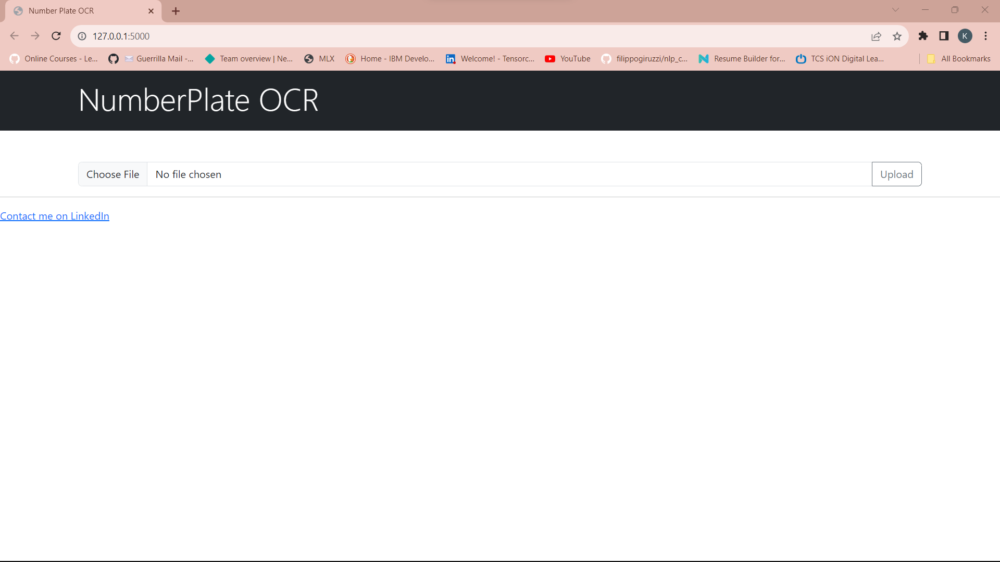
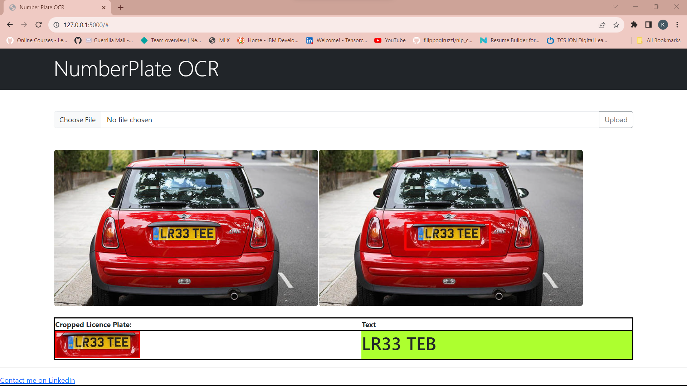

# NumberPlate-OCR
Performing Optical Character Recognition on Number plates of cars using CNN and EasyOCR.

### Process:
```
1. Used Annotation tool LabelImg, https://github.com/HumanSignal/labelImg, to annote images, creating bounding boxes around the number plates.
2. Created a CNN to identify the number plate region in input images and create a bounding box around the interested region.
3. Used EasyOCR library to extract text from the detected number plate from input image.
4. Created a flask app for user to upload the image to and perform OCR on the image.
```


### Requirements:
```
1. Flask
2. Tensorflow
3. Django
4. EasyOCR
5. Pandas
6. Numpy
7. OpenCy-Python
8. XML
9. Glob
10. Matplotlib
```


### Screenshots:




